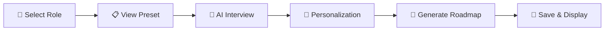
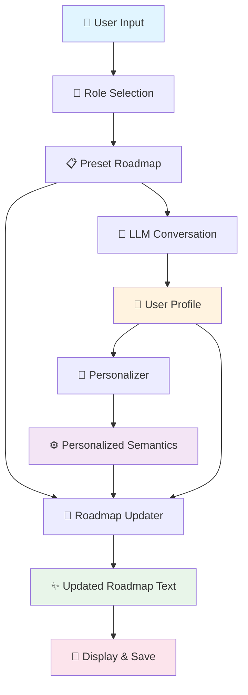

<div align="center">

# 🎓 Personalized Learning Roadmap Generator

### *Your AI-Powered Career Development Companion*

[](https://www.python.org/downloads/)
[](https://deepmind.google/technologies/gemini/)
[](https://opensource.org/licenses/MIT)
[]()

**Transform your learning journey with AI-driven personalization**

*A sophisticated CLI and Web application that generates tailored learning roadmaps through intelligent conversation, deep profile analysis, and adaptive content generation.*

[🚀 Quick Start](#-two-usage-modes) • [📖 Documentation](#-project-structure) • [🎮 Usage](#-usage) • [🤝 Contributing](#-contributing)

---

</div>

## 🎯 Overview

This project orchestrates a **complete personalized learning experience** through intelligent AI orchestration:

<table>
<tr>
<td width="50px" align="center">1️⃣</td>
<td><strong>Role Selection</strong><br/>Choose your target career path from 5 curated roles</td>
</tr>
<tr>
<td align="center">2️⃣</td>
<td><strong>Preset Roadmap Display</strong><br/>Preview the standard learning path for your role</td>
</tr>
<tr>
<td align="center">3️⃣</td>
<td><strong>AI Conversation</strong><br/>Gemini AI interviews you about skills, experience, and goals</td>
</tr>
<tr>
<td align="center">4️⃣</td>
<td><strong>Smart Personalization</strong><br/>Deep analysis adjusts priorities, hours, and recommendations</td>
</tr>
<tr>
<td align="center">5️⃣</td>
<td><strong>Roadmap Generation</strong><br/>AI creates your customized learning path</td>
</tr>
<tr>
<td align="center">✅</td>
<td><strong>Output & Save</strong><br/>Review and export your personalized roadmap</td>
</tr>
</table>

## 🚀 Two Usage Modes

### 🌐 **Web Application** (Recommended)

> 💎 Beautiful, minimalist UI with curved design and smooth animations

**⚡ Quick Start:**
```bash
# Install dependencies
pip install -r requirements-web.txt

# 🪟 Windows: One-click startup
start.bat

# 🐧 Manual startup:
python app.py                              # 🔧 Backend server
cd frontend && python -m http.server 8000  # 🎨 Frontend server
```

**🌍 Access:** Open [`http://localhost:8000`](http://localhost:8000) in your browser

---

### 💻 **Command Line Interface**

> ⚡ Lightning-fast terminal-based experience for power users

**Quick Start:**
```bash
python main.py
```

**🎯 Perfect for:** Automation, scripting, and CI/CD pipelines

## 📁 Project Structure

<details>
<summary><strong>📂 Click to expand full directory tree</strong></summary>

```
4-2-26/
├── main.py                      # Main orchestrator (entry point)
├── llm/                         # Conversation engine
│   ├── conversation_engine.py   # Manages user conversation
│   ├── gemini_client.py         # Gemini API wrapper
│   ├── role_guides.py           # Role definitions
│   ├── system_prompt.py         # LLM system prompt
│   └── user_profile.py          # User profile management
├── personalizer/                # Roadmap personalization
│   ├── service.py               # Main personalization service
│   ├── loader.py                # Load semantic roadmaps
│   ├── llm.py                   # LLM interface (mock)
│   ├── transform.py             # Apply personalization
│   ├── prompt.py                # Personalization prompts
│   └── schemas.py               # Data validation
├── roadmap_updater/             # NEW: Roadmap generation
│   ├── updater.py               # Main roadmap updater
│   └── gemini_client.py         # Gemini API client
├── fake frontend/               # Preset roadmaps (text format)
│   ├── ai-ds                    # AI & Data Scientist roadmap
│   ├── fs                       # Full Stack Developer roadmap
│   ├── ml                       # Machine Learning Engineer roadmap
│   ├── gd                       # Game Developer roadmap
│   └── sa                       # Software Architect roadmap
├── conversion/                  # Pipeline for semantic data
├── data/                        # Source roadmap data
└── output/                      # Generated personalized outputs
    ├── {role}_profile.json      # User profile
    ├── {role}_personalized.json # Personalized semantic data
    └── {role}_roadmap.txt       # Final personalized roadmap
```

</details>

## ⚙️ Installation

### Prerequisites
- 🐍 Python 3.8 or higher
- 🔑 Google Gemini API key ([Get one here](https://makersuite.google.com/app/apikey))

### Setup Steps

<table>
<tr>
<td width="50px" align="center">1️⃣</td>
<td>

**Navigate to project directory**
```bash
cd C:\Users\Subbu\Desktop\Projects\4-2-26
```

</td>
</tr>
<tr>
<td align="center">2️⃣</td>
<td>

**Install core dependencies**
```bash
pip install google-generativeai python-dotenv
```

**For web mode, also install:**
```bash
pip install -r requirements-web.txt
```

</td>
</tr>
<tr>
<td align="center">3️⃣</td>
<td>

**Configure API key**

Create a `.env` file in the project root:
```env
GEMINI_API_KEY=your_gemini_api_key_here
```

</td>
</tr>
</table>

## 🎮 Usage

### 🚀 Launch the Application

```bash
python main.py
```

### 🎬 Interactive Flow



<details>
<summary><strong>📖 Detailed Step-by-Step Guide</strong></summary>

#### 1️⃣ **Select Your Role**
Choose from 5 carefully curated career paths:
- 🤖 AI & Data Scientist
- 💻 Full Stack Developer
- 🎮 Game Developer
- 🧠 Machine Learning Engineer
- 🏗️ Software Architect

#### 2️⃣ **View Preset Roadmap**
- 📊 Review the standard learning path for your role
- 👀 Understand the baseline curriculum
- ⏎ Press Enter to continue

#### 3️⃣ **AI-Powered Conversation**
- 🤝 Engage with Gemini AI in a natural conversation
- 💬 Answer questions about your:
  - Current skill level
  - Professional experience
  - Learning goals
  - Time availability
- ✍️ Type naturally and honestly
- ✅ Type `done` when you're finished

#### 4️⃣ **Smart Personalization**
- 🧠 AI analyzes your complete profile
- ⚙️ Automatically adjusts:
  - Topic priorities
  - Learning hours
  - Resource recommendations
  - Difficulty progression

#### 5️⃣ **View Your Custom Roadmap**
- 🎯 See your personalized learning path
- 📈 Tailored specifically to your experience and goals
- ⏎ Press Enter to continue

#### 6️⃣ **Results Saved**
Check the `output/` folder for your generated files:
- 📄 `{role}_profile.json` - Your complete user profile
- 🎯 `{role}_personalized.json` - Personalized semantic data
- 📝 `{role}_roadmap.txt` - Your final custom roadmap

</details>

## 🔧 Module Architecture

<table>
<tr>
<th width="200px">Module</th>
<th>Purpose</th>
<th>Key Components</th>
</tr>

<tr>
<td>💬 <strong>LLM Module</strong><br/><code>llm/</code></td>
<td>
<strong>Conversational AI Engine</strong><br/>
Extracts user information through natural dialogue<br/>
🤖 Powered by: <strong>Gemini 2.5 Flash</strong>
</td>
<td>
• <code>conversation_engine.py</code> - Conversation orchestration<br/>
• <code>gemini_client.py</code> - Gemini API wrapper<br/>
• <code>user_profile.py</code> - Profile management<br/>
• <code>role_guides.py</code> - Role definitions<br/>
• <code>system_prompt.py</code> - AI prompting
</td>
</tr>

<tr>
<td>🎯 <strong>Personalizer</strong><br/><code>personalizer/</code></td>
<td>
<strong>Profile Analysis Engine</strong><br/>
Analyzes user data and updates roadmap semantics
</td>
<td>
• <code>service.py</code> - Main personalization pipeline<br/>
• <code>transform.py</code> - Priority/hour adjustments<br/>
• <code>loader.py</code> - Semantic data loader<br/>
• <code>schemas.py</code> - Data validation
</td>
</tr>

<tr>
<td>✨ <strong>Roadmap Updater</strong><br/><code>roadmap_updater/</code><br/><span style="color: #00aa00;">⭐ NEW</span></td>
<td>
<strong>AI Content Generator</strong><br/>
Generates personalized roadmap text<br/>
🤖 Powered by: <strong>Gemini 2.5 Flash</strong>
</td>
<td>
• <code>updater.py</code> - Roadmap generation logic<br/>
• <code>gemini_client.py</code> - Gemini API client<br/><br/>
<strong>Inputs:</strong><br/>
→ Preset roadmap text<br/>
→ Personalized semantics<br/>
→ User profile<br/><br/>
<strong>Output:</strong><br/>
← Updated roadmap (tree format)
</td>
</tr>

<tr>
<td>🎛️ <strong>Orchestrator</strong><br/><code>main.py</code></td>
<td>
<strong>System Coordinator</strong><br/>
Coordinates all modules in sequence
</td>
<td>
<strong>Flow Pipeline:</strong><br/>
Selection → Display → Conversation →<br/>
Personalization → Generation → Display
</td>
</tr>
</table>

## 📊 Data Flow Architecture



<details>
<summary><strong>📝 Detailed Pipeline Explanation</strong></summary>

1. **🧑 User Input** → User launches the application
2. **🎯 Role Selection** → Choose target career path
3. **📋 Preset Roadmap** → Load standard learning path
4. **💬 LLM Conversation** → AI interviews user about background
5. **👤 User Profile** → Extract and structure user data
6. **🎯 Personalizer** → Analyze profile and adjust semantics
7. **⚙️ Personalized Semantics** → Generate customized priorities
8. **📝 Roadmap Updater** → AI generates final roadmap text
9. **✨ Updated Roadmap** → Complete personalized learning path
10. **💾 Display & Save** → Show and persist results

</details>

## 🧪 Testing

### Run Tests

| Test Type | Command | Purpose |
|-----------|---------|----------|
| 💬 **LLM Module** | `cd llm && python test_gemini.py` | Test AI conversation engine |
| 🎯 **Personalizer** | `cd personalizer && python test_run.py` | Test personalization logic |
| 🔄 **End-to-End** | `python main.py` | Full system integration test |

> 💡 **Tip:** Run individual module tests first to isolate issues before testing the full pipeline

## ⚙️ Configuration

### 🎭 Available Roles

<table>
<tr>
<td>🤖</td>
<td><strong>AI & Data Scientist</strong></td>
<td><code>ai_data_scientist</code></td>
</tr>
<tr>
<td>💻</td>
<td><strong>Full Stack Developer</strong></td>
<td><code>full_stack</code></td>
</tr>
<tr>
<td>🧠</td>
<td><strong>Machine Learning Engineer</strong></td>
<td><code>machine_learning</code></td>
</tr>
<tr>
<td>🎮</td>
<td><strong>Game Developer</strong></td>
<td><code>game_developer</code></td>
</tr>
<tr>
<td>🏗️</td>
<td><strong>Software Architect</strong></td>
<td><code>software_architect</code></td>
</tr>
</table>

### 🎨 Customization Options

<details>
<summary><strong>➕ Add New Roles</strong></summary>

1. **Add roadmap file** to `fake frontend/`
2. **Update role definitions** in [llm/role_guides.py](llm/role_guides.py)
3. **Add mapping** in [main.py](main.py) `PRESET_ROADMAPS` dictionary

```python
PRESET_ROADMAPS = {
    "your_new_role": "fake frontend/your-role",
    # ... existing roles
}
```

</details>

<details>
<summary><strong>⏱️ Adjust Conversation Length</strong></summary>

Modify `max_turns` parameter in [main.py](main.py):

```python
def run_conversation(role_key: str, max_turns: int = 10):
    # Increase or decrease max_turns as needed
```

</details>

<details>
<summary><strong>🤖 Change LLM Model</strong></summary>

Update the model name in Gemini client files:

- [llm/gemini_client.py](llm/gemini_client.py)
- [roadmap_updater/gemini_client.py](roadmap_updater/gemini_client.py)

```python
model = genai.GenerativeModel('gemini-2.5-flash')  # Change model here
```

Available models: `gemini-2.5-flash`, `gemini-2.0-pro`, etc.

</details>

## 🔐 Environment Variables

**Required in `.env` file:**

| Variable | Description | Required |
|----------|-------------|----------|
| `GEMINI_API_KEY` | Your Google Gemini API key | ✅ Yes |

**Get your API key:** [Google AI Studio](https://makersuite.google.com/app/apikey)

---

## 📦 Dependencies

### Core Dependencies
```
google-generativeai  # 🤖 Gemini API client
python-dotenv        # 🔐 Environment management
```

### Web Application Dependencies
```
flask==3.0.0         # 🌐 Web framework
flask-cors==4.0.0    # 🔒 CORS handling
```

## 🤝 Contributing

> We welcome contributions! This project follows a clean, modular architecture.

### 🏗️ Architecture Principles

- ✅ **Modularity** - Each module is independent and testable
- ✅ **Consistency** - Use the same LLM client pattern across modules
- ✅ **Orchestration** - Follow the pipeline pattern in [main.py](main.py)
- ✅ **Type Safety** - Use schemas and validation
- ✅ **Documentation** - Keep code well-commented

### 🚀 How to Contribute

1. 🍴 Fork the repository
2. 🌿 Create a feature branch (`git checkout -b feature/amazing-feature`)
3. 💾 Commit your changes (`git commit -m 'Add amazing feature'`)
4. 📤 Push to the branch (`git push origin feature/amazing-feature`)
5. 🎉 Open a Pull Request

---

## 📄 License

**MIT License** - See [LICENSE](LICENSE) for details

Feel free to use, modify, and distribute this project as you see fit.

---

## ✨ Features

<table>
<tr>
<td width="50%">

### 🎨 User Experience
- ✅ Interactive CLI interface
- ✅ Beautiful web application
- ✅ Smooth conversation flow
- ✅ Real-time feedback
- ✅ Progress tracking

</td>
<td width="50%">

### 🧠 AI Capabilities
- ✅ AI-powered conversations
- ✅ Smart personalization
- ✅ Adaptive content generation
- ✅ Context-aware recommendations
- ✅ Profile analysis

</td>
</tr>
<tr>
<td>

### 🎯 Learning Features
- ✅ 5 curated career roles
- ✅ Personalized priorities
- ✅ Dynamic hour allocation
- ✅ Custom resource recommendations
- ✅ Skill-based adjustments

</td>
<td>

### 🔧 Technical Features
- ✅ Modular architecture
- ✅ Persistent storage
- ✅ JSON export
- ✅ Extensible design
- ✅ Type validation

</td>
</tr>
</table>  

## 🐛 Troubleshooting

<details>
<summary><strong>❌ ModuleNotFoundError</strong></summary>

**Symptoms:**
```
ModuleNotFoundError: No module named 'llm' or 'personalizer'
```

**Solutions:**
- ✅ Ensure you're running from project root directory
- ✅ Check Python path includes all module folders
- ✅ Verify directory structure is intact

```bash
# Check current directory
pwd  # Should show: .../4-2-26

# Run from project root
python main.py
```

</details>

<details>
<summary><strong>🔑 API Key Error</strong></summary>

**Symptoms:**
```
Error: GEMINI_API_KEY not found or invalid
```

**Solutions:**
- ✅ Verify `.env` file exists in project root
- ✅ Check `GEMINI_API_KEY` is correctly set
- ✅ Ensure API key is valid and active
- ✅ Check for extra spaces or quotes in `.env`

**Correct `.env` format:**
```env
GEMINI_API_KEY=your_actual_key_here
```

</details>

<details>
<summary><strong>💬 Conversation Issues</strong></summary>

**Problem:** Conversation doesn't start or hangs

**Solutions:**
- ✅ Type `done` to skip conversation if needed
- ✅ Press `Ctrl+C` to interrupt gracefully
- ✅ Check internet connection for API calls
- ✅ Verify API key has sufficient quota

</details>

<details>
<summary><strong>📁 File Not Found</strong></summary>

**Problem:** Can't find roadmap files or output

**Solutions:**
- ✅ Check `fake frontend/` directory exists
- ✅ Verify `output/` folder is created automatically
- ✅ Run from project root, not subdirectories

</details>

---

## 📞 Support & Resources

### 🆘 Getting Help

1. **📋 Check Terminal Output**
   - Look for detailed error messages
   - Stack traces show exact issue location

2. **📂 Verify Output Folder**
   - Check `output/` for generated files
   - Review JSON files for data integrity

3. **🧪 Run Module Tests**
   - Test individual modules to isolate issues
   - Use test scripts in each module folder

4. **📖 Review Documentation**
   - Read this README carefully
   - Check inline code comments

### 🔗 Useful Links

- 🤖 [Gemini API Documentation](https://ai.google.dev/docs)
- 🐍 [Python Official Docs](https://docs.python.org/3/)
- 🔑 [Get Gemini API Key](https://makersuite.google.com/app/apikey)

---

<div align="center">

### 🌟 Star this project if you find it helpful!

**Made with ❤️ and 🤖 AI**

*Empowering learners through intelligent personalization*

[⬆ Back to Top](#-personalized-learning-roadmap-generator)

</div>
